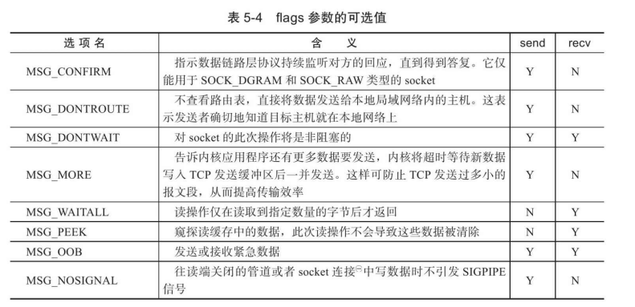
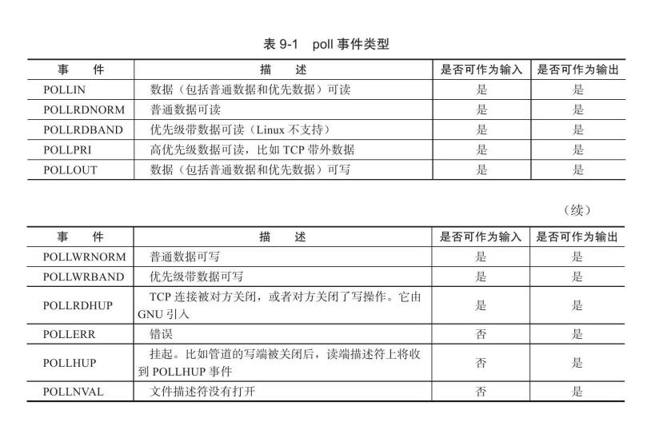

http连接处理类
===============

根据状态转移,通过主从状态机封装了http连接类。其中,主状态机在内部调用从状态机,从状态机将处理状态和数据传给主状态机

> * 客户端发出http连接请求
> * 从状态机读取数据,更新自身状态和接收数据,传给主状态机
> * 主状态机根据从状态机状态,更新自身状态,决定响应请求还是继续读取

---


### 基础知识

#### 什么是套接字地址？

套接字地址一个IP地址和端口对 （ip，port）。它唯一地表示了使用TCP通信的一端。

#### 套接字一些基础API

​		socket的主要API都定义在`<sys/socket.h>`头文件 中，包括创建socket、命名socket、监听socket、接受连接、发起连接、 读写数据、获取地址信息、检测带外标记，以及读取和设置socket选项。

​		个人理解：socket用来创建一个类似于插座的东西，bind用来绑定插座和ip地址。这个插座其实就是文件描述符，服务器与客户端通过文件描述符通信。

​	下面来介绍这些API

```c++
//创建套接字
//domain表示使用什么协议族，对于TCP/IP协议族对应的参数的为PF_INET(IPv4)和PF_INET6(IPv6);

//type参数指定服务类型。服务类型主要有SOCK_STREAM服务(流服务)和SOCK_UGRAM(数据报)服务。对TCP/IP协议族而言，其值取SOCK_STREAM表示传输层使用TCP协议，取SOCK_DGRAM表示传输层使用UDP协议。

//protocol参数是在前两个参数构成的协议集合下，再选择一个具体的协议。不过这个值通常都是唯一的(前两个参数已经完全决定了它的值)。几乎在所有情况下，我们都应该把它设置为0，表示使用默认协议。

//当成功时候返回一个socket的文件描述符，失败返回-1并且设置errno
int socket(int domain,int type,int protocol);

```

```c++
//将一个socket与socket地址绑定称为给socket命名。
//socketfd就是创建stocket的时候返回的文件描述符
//my_addr所指的socket地址分配给未命名的sockfd文件描述符，addrlen参数指出该socket地址的长度
//sockaddr结构如下:
struct sockaddr
{
    sa_family_t sa_family;
    char sa_data[14];
}
//命名socket
//bind成功时返回0，失败则返回-1并设置errno。
int bind(int sockfd,const struct sockaddr*my_addr,socklen_t
addrlen);
```

```c++
//监听socket
//创建socket后，开始监听，等待客户端连接
//sockfd参数指定被监听的socket。backlog参数提示内核监听队列的最大长度。监听队列的长度如果超过backlog，服务器将不受理新的客户连接。

//listen成功时返回0，失败则返回-1并设置errno。
int listen(int sockfd,int backlog);
```

```c++
//当有客户端连接时，接收连接
//socketfd表示监听的socket文件描述符，addr用来存储连接到服务器的地址
//accept成功时返回一个新的连接socket，该socket唯一地标识了被接受的这个连接，服务器可通过读写该socket来与被接受连接对应的客户端通信。accept失败时返回-1并设置errno。
int accept(int sockfd,struct sockaddr*addr,socklen_t*addrlen);
```

```c++
//发起连接
//客户端可以主动发起连接
int connect(int sockfd,const struct sockaddr*serv_addr,socklen_t
addrlen);
```

```c++
//关闭连接
//shutdown成功时返回0，失败则返回-1并设置errno
int close(int fd);
```

#### 数据读写

```c++
//读写API
/*
recv读取sockfd上的数据，buf和len参数分别指定读缓冲区的位置和大小，flags参数的含义见后文，通常设置为0即可。recv成功时返回实际读取到的数据的长度，它可能小于我们期望的长度len。因此我们可能要多次调用recv，才能读取到完整的数据。recv可能返回0，这意味着通信对方已经关闭连接了。recv出错时返回-1并设置errno。send往sockfd上写入数据，buf和len参数分别指定写缓冲区的位置和大小。send成功时返回实际写入的数据的长度，失败则返回-1并设置
errno
*/
ssize_t recv(int sockfd,void*buf,size_t len,int flags);
ssize_t send(int sockfd,const void*buf,size_t len,int flags);
```


flag含义如下：



#### I/O复用

````c++
/*epoll把用户关心的文件描述符上的事件放在内核里的一个事件表中，从而无须像select和poll那样每次调用都要重复传入文件描述符集或事件集。但epoll需要使用一个额外的文件描述符，来唯一标识内核中的这个事件表。*/

//这个文件描述符使用如下epoll_create函数来创建
int epoll_create(int size)
/*
size参数现在并不起作用，只是给内核一个提示，告诉它事件表需要多大。该函数返回的文件描述符将用作其他所有epoll系统调用的第一个参数，以指定要访问的内核事件表。
*/
````

````c++
//操作epoll的内核事件表
//epoll_ctl成功时返回0，失败则返回-1并设置errno。
int epoll_ctl(int epfd,int op,int fd,struct epoll_event*event);
//fd参数是要操作的文件描述符，op参数则指定操作类型。
//操作类型有如下三种：
/*
 1. EPOLL_CTL_ADD，往事件表中注册fd上的事件。
 2. EPOLL_CTL_MOD，修改fd上的注册事件。
 3.EPOLL_CTL_DEL，删除fd上的注册事件。
*/
//event参数指定事件，它是epoll_event结构指针类型。
//epoll_event的定义如下:

//struct epoll_event
//{
//__uint32_t events;/*epoll事件*/
//epoll_data_t data;/*用户数据*/
//};

/*
其中events成员描述事件类型。epoll支持的事件类型和poll基本相同。表示epoll事件类型的宏是在poll对应的宏前加上“E”，比如epoll的数据可读事件是EPOLLIN。但epoll有两个额外的事件类型——EPOLLET和EPOLLONESHOT。它们对于epoll的高效运作非常关键

data成员用于存储用户数据，其类型epoll_data_t的定义如下

typedef union epoll_data
{
    void*ptr;
    int fd;
    uint32_t u32;
    uint64_t u64;
}epoll_data_t;

    epoll_data_t是一个联合体，其4个成员中使用最多的是fd，它指定事件所从属的目标文件描述符。ptr成员可用来指定与fd相关的用户数据。但由于epoll_data_t是一个联合体，我们不能同时使用其ptr成员和fd成员，因此，如果要将文件描述符和用户数据关联起来，以实现快速的数据访问，只能使用其他手段，比如放弃使用epoll_data_t的fd成员，而在ptr指向的用户数据中包含fd。
*/
````



```c++
//epoll系列系统调用的主要接口是epoll_wait函数。它在一段超时时间内等待一组文件描述符上的事件，其原型如下:
//成功时返回就绪的文件描述符的个数，失败时返回-1并设置errno。
int epoll_wait(int epfd,struct epoll_event*events,int maxevents,int timeout);
/*
epoll_wait函数如果检测到事件，就将所有就绪的事件从内核事件
表（由epfd参数指定）中复制到它的第二个参数events指向的数组中。
这个数组只用于输出epoll_wait检测到的就绪事件，而不像select和poll
的数组参数那样既用于传入用户注册的事件，又用于输出内核检测到
的就绪事件。这就极大地提高了应用程序索引就绪文件描述符的效
率。
*/
```

#### LT和ET模式

> ​	epoll对文件描述符的操作有两种模式：LT（Level Trigger，电平 触发）模式和ET（Edge Trigger，边沿触发）模式。LT模式是默认的 工作模式，这种模式下epoll相当于一个效率较高的poll。当往epoll内 核事件表中注册一个文件描述符上的EPOLLET事件时，epoll将以ET 模式来操作该文件描述符。ET模式是epoll的高效工作模式。
>
> ​		 对于采用LT工作模式的文件描述符，当epoll_wait检测到其上有事 件发生并将此事件通知应用程序后，应用程序可以不立即处理该事 件。这样，当应用程序下一次调用epoll_wait时，epoll_wait还会再次向 应用程序通告此事件，直到该事件被处理。而对于采用ET工作模式的 文件描述符，当epoll_wait检测到其上有事件发生并将此事件通知应用 程序后，应用程序必须立即处理该事件，因为后续的epoll_wait调用将 不再向应用程序通知这一事件。可见，ET模式在很大程度上降低了同 一个epoll事件被重复触发的次数，因此效率要比LT模式高。


### HTTP处理流程

- 浏览器端发出http连接请求，主线程创建http对象接收请求并将所有数据读入对应buffer，将该对象插入任务队列，工作线程从任务队列中取出一个任务进行处理。先全部读进buffer中，然后再根据buffer中的内容进行解析，具体细节看看解析。
- 工作线程取出任务后，调用process_read函数，通过主、从状态机对请求报文进行解析。
- 解析完之后，跳转do_request函数生成响应报文，通过process_write写入buffer，返回给浏览器端。


